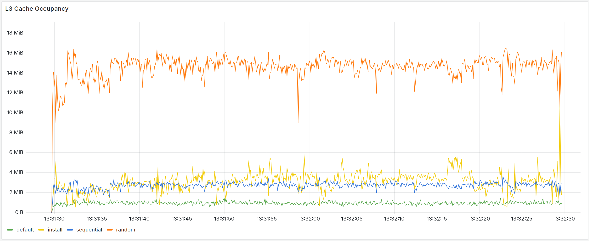
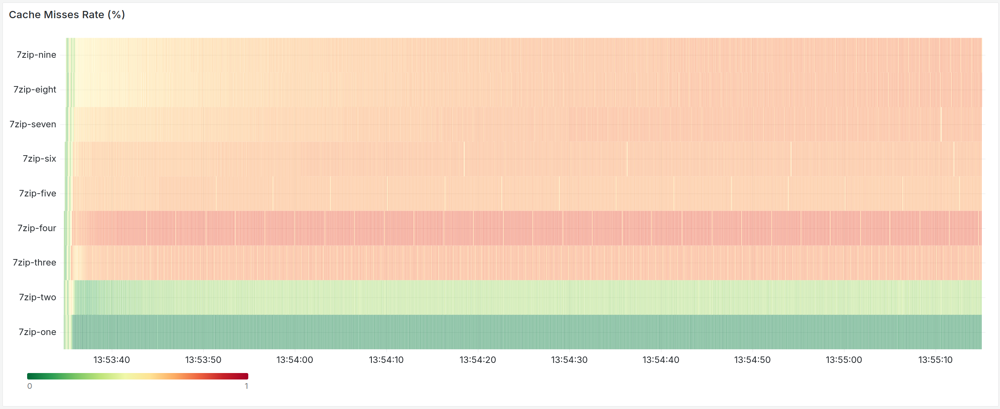

# container-bench - A configurable and flexible tool for defining and running container-based  benchmarks

Define and orchestrate benchmarks in YML files. The tool automatically pulls the needed images, sets up and instruments every container using perf and cgroups, Docker stats, and the [Intel Resource Director Technology (RDT)](https://www.intel.com/content/www/us/en/architecture-and-technology/resource-director-technology.html). The data is exported to CSV or an InfluxDB, which can be connected to a [Grafana instance](https://info.jakob-eberhardt.de/dashboard/snapshot/zJJELpDXZhe16YJ3TmTySN4Bx8gr502v) for analysis. Despite the rich amount of data that the application can collect, it is optimized to maintain a minimal memory footprint. This limits the impact on shared resources such as the last-level cache during benchmarking. Additionally, the application can be used to implement and benchmark real-time optimization engines using the collected metrics and the allocation of shared resources using an RDT integration interface.

## Goal
The application facilitates benchmarking and enables a comprehensive overview of related metrics. For example, the collected data includes the instructions per cycle (IPC) executed by the applications running inside the studied containers, as can be seen in the following figure. The full benchmark is available [here](https://info.jakob-eberhardt.de/dashboard/snapshot/zJJELpDXZhe16YJ3TmTySN4Bx8gr502v) 

---


The benchmark configuration can be seen in the respective [benchmarks/examples/benchmark.yml](./benchmarks/examples/benchmark.yml). It includes four different containers, each running different applications. `default` copies values, `install` installs packages using a package manager, `sequential` accesses memory in a sequential pattern, while `random` performs random memory accesses. As can be seen, each workload results in a different amount of instructions per cycle executed inside the container. In addition, depending on the kind of workloads executed on the same CPU, containers may interfere with regard to shared resources such as the last-level cache, memory bandwidth, branch predictors, or prefetchers. As can be seen in the following figure, the application integration with Intel's Resource Director (RDT) framework allows us to study the caching behavior of the different workloads. 



Similarly, `container-bench` can be used to determine if the branching behavior of a workload is affecting the overall performance.


Using the collected metrics, a `scheduler` implementation can make optimization decisions, such as moving containers that cause a specific kind of inference regarding shared resources to a different socket or isolating them using CGroups or the Intel Resource Director. The profiling for these decisions happens completely online, meaning that while the workloads are running concurrently. The scheduler can issue a probe to analyze the resource and inference profile of a given container using a `probe kernel`. The following figure illustrates how the IPC of distinct workloads can be improved, boosting the overall performance.

 
> **_Note:_**  In this example, we run a total of 32 concurrent containers on a two-socket server. Some containers that run shared-resource-intensive workloads, e.g., `stress-ng` microbenchmarks that target the LLC, such as `matrix-3d` or `cache-level 3`, are allocated to the same socket, forcing them to share the given resources, which leads to consistently poor IPC. Unlike this, the performance of other workloads, such as `matrixprod` or `heapsort`, is determined by exclusive resources such as L1 or L2 caches. 

 
> **_Dynamic Improvement by relocating Containers:_**  In this example, we run same set of cotnainers initially mapped to the same cores and sockets. Fifty percent of the workloads can be considered highly sensitive to inference on shared resources, while the rest are insensitive. Initially, all sensitive workloads are running on socket one, which results in the worst-case performance. However, the dynamic scheduler detects and continuously balances the inference across the sockets such that the overall performance and IPC increase. The scheduler achieves this by swapping core affinities of *high* and *low* sensitivity workloads across the two sockets. 

More benchmarks are available in the respective [example section](#examples)

## Features
- **Multi-Container Benchmarking**: Define and run benchmarks with multiple containers
- **Performance Monitoring**: 
  - Hardware performance counters via perf (cgroup-based)
  - Docker container statistics
  - Intel RDT cache and memory bandwidth monitoring
- **Thread-Safe Data Collection**: Real-time data collection with concurrent goroutines
- **Flexible Scheduling**: Scheduler interface for implementing resource management policies
- **Database Integration**: Export time-series data to InfluxDB 2.7
- **Metadata Collection**: Automatic collection of benchmark metadata for reporting
- **YAML Configuration**: Easily define and run benchmarks
- **PGF/TikZ Plot Generation**: Generate PGF/TikZ plots from the data base instantly

## Installation
```bash
git clone https://github.com/jakobeberhardt/container-bench.git
cd container-bench
make
./container-bench help

```
### Prerequisites
- Go 1.23 or later
- Docker
- Linux kernel with perf events support
- Intel RDT support (optional, for cache allocation monitoring)
- InfluxDB 2.7+ instance

For the full installation, including the compatible `go` version, Docker, perf, and the Intel Resource Director packages and setup, you can run:

```bash
curl -ssL https://raw.githubusercontent.com/jakobeberhardt/container-bench/refs/heads/main/setup/get-container-bench.sh | sudo sh
```
## Configuration
### Environment Variables
The application automatically loads environment variables from an `.env` file in the current directory or the application directory. Create a `.env` file with your InfluxDB configuration:

```bash
# .env file
INFLUXDB_HOST=https://your-influxdb-host
INFLUXDB_USER=your-username
INFLUXDB_TOKEN=your-token
INFLUXDB_ORG=your-org
INFLUXDB_BUCKET=benchmarks
```

### Benchmark Configuration
Define benchmarks in YAML files. See `benchmarks/examples/benchmark.yml` for a complete example:

```yaml
benchmark:
  name: "My Benchmark"
  description: "Description of the benchmark"
  max_t: 30  # Maximum duration in seconds
  log_level: info
  scheduler:
    implementation: default # Scheduler used during the benchmark
    rdt: false # allow scheduler to use RDT allocation
    log_level: warn # Loglevel specific to the scheduler
  data:
    db:
      host: ${INFLUXDB_HOST}
      name: ${INFLUXDB_BUCKET}
      user: ${INFLUXDB_USER}
      password: ${INFLUXDB_TOKEN}
      org: ${INFLUXDB_ORG}
container0:
  index: 0
  port: 8080:8080 # incase you need a port 
  image: nginx:alpine
  core: 0  # CPU core affinity, for multi-core e.g. '0,1,2' or 0-15
  start_t: 0       # Optional: start container at t=start_t seconds (default: 0)
  stop_t: 30       # Optional: stop container at t=stop_t seconds (default: max_t)
  expected_t: 25   # Optional: error if (stop-start) < expected_t
  command: "stress-ng --cpu 1 --timeout 25s" # Command which will be executed upon start. Can also be empty
  environment:
    FOO: hello
    BAR: world
  privileged: false # default
  volumes:
    - ./data:/data
  data:
    frequency: 100  # Collection frequency in ms
    perf: true      # Enable perf monitoring
    docker: true    # Enable Docker stats
    rdt: false      # Enable Intel RDT data collection
```

### Generated Traces (Seed-Based)
For long experiments, you can generate a trace from distributions instead of manually listing every job.

- Keep `benchmark:` metadata unchanged.
- Add top-level `arrival:` parameters (inter-arrival time + job length distribution).
- Add top-level `data:` defaults (applied to every generated job).
- Add `workloads:` as a pool of templates.

Duration handling:
- The generator samples a duration (seconds) from `arrival.length` and sets `start_t/stop_t/expected_t` accordingly.
- Commands are expected to run indefinitely (e.g., `stress-ng --timeout 0`); the orchestrator stops containers at `stop_t`.

Example: `benchmarks/qos/0-trace-generated.yml`

## Usage
### Validate Configuration
```bash
./container-bench validate -c benchmarks/examples/benchmark.yml
```

### Running a Benchmark
```bash
# Using the .env file 
sudo ./container-bench run -c benchmarks/examples/benchmark.yml
```

## Data
The tool can currently collect the following metrics:

### Perf Metrics (Hardware Counters)
- Cache misses and references
- Instructions and CPU cycles
- Branch instructions and misses
- L1/L3 cache metrics
- Derived metrics (cache miss rate, branch miss rate)

### Docker Metrics
- CPU usage (total, kernel, user, percentage)
- Memory usage (total, RSS, cache, swap)
- Network I/O (bytes and packets)
- Disk I/O (bytes and operations)

### RDT Metrics
- L3 cache occupancy
- Memory bandwidth usage
- CLOS group assignment
> **_Important:_**  To further reduce the memory foot print of the instrumentation, collection frequency for each counter can be configured.  

### Metadata Collection
Container-bench automatically collects comprehensive metadata for each benchmark run, including:

- Benchmark configuration and timing information
- Host system details (hostname, OS, CPU specifications)
- Data collection statistics (sampling steps, measurements, data size)
- Original configuration file content

Metadata is exported to the `benchmark_meta` table for generating detailed reports. 

### Key Components
- **Dataframes**: Thread-safe data structures for storing time-series metrics
- **Collectors**: Goroutines that collect metrics at specified frequencies
- **Scheduler**: Interface for implementing resource management policies using the Intel Resource Director
- **Database**: InfluxDB integration for data export and analysis
- **Analysis**: The data base can be plugged into Grafana to visualize benchmarking results right after completion

## Database Schema
Data is exported to InfluxDB with the following structure:

### Time-Series Data
- **Measurement**: `benchmark_metrics`
- **Tags**: `benchmark_id`, `container_index`, `container_image`, `container_core`
- **Fields**: All collected metrics with prefixes:
  - `perf_*`: Performance counter metrics
  - `docker_*`: Docker statistics
  - `rdt_*`: Intel RDT metrics
### Metadata
- **Measurement**: `benchmark_meta`
- **Tags**: `benchmark_id`
- **Fields**: Comprehensive metadata including system info, configuration, and statistics

## Plotting
Plots can be generated using the `plot` command. The application supports time series plots and polar plots for sensitivity probing results.

### Timeseries
A large example can be seen here:
```sh
container-bench plot timeseries --benchmark-id 7 --interval 0.5 --y perf_instructions_per_cycle > docs/tex/timeseries/example.tex
```
<p align="center">
  
</p>

We can easily share the legend to build group plots. The scaffolding for this is auto-generated. 

<p align="center">
  
</p>

### Polar / Radar / Spider Web
Polar plots can be generated from different sensitivity probing, e.g., here probes 1-11, which all come from different benchmarks. In this case, we compare different `gcc` and `7zip` configurations to showcase how the sensitivity profile can depend on the respective configuration of an application. 

```sh
container-bench plot polar --probes 1,2,3,4,5,6,7,8,9,10,11 > docs/tex/polar/example.tex
```
<p align="center">
  
</p> 

## Examples
### High Concurrency
The results of this benchmark are available [here](https://info.jakob-eberhardt.de/dashboard/snapshot/DPO4XqekVeIm54BdQh3FgHOhZE2yRmhh) on Grafana. The `benchmarks/examples/lots_of_neigbors` configuration files start more and more containers running a simple workload that accesses the buffer in a random pattern. In the following figures, we can see how the initial container executes fewer and fewer instructions while the pressure on the L3 cache rises as more and more containers have to share it. Collecting a wide range of data from many containers at the same time is possible because of the asynchronous and concurrent design of the benchmark driver, as well as the small memory footprint of the data collection. 


## Compression
In this example, which was created using the [7zip benchmark](./examples/7z.yml) file `benchmarks/examples/7z.yml`, we can compare the different compression levels of `7zip` from one (low) to nine (high), which each run in a separate container. The full data is available [here](https://info.jakob-eberhardt.de/dashboard/snapshot/KxMaNhyyRod5k4Uxup34Tgw95MyN2Olt) on Grafana. The following heat map indicates the IPC throughout the benchmark for each level. In general, we see that for higher levels, the IPC decreases over time. We can correlate this with the respective heat map of the cache misses. 




Additionally, we can observe that the higher the compression level and the longer the benchmark is running, see more and more branch mispredictions, as can be seen in the following plot for levels `one`, `five`, and `nine`. Additionally, we can see an iterative pattern.  


## Neighbor
The `benchmarks/examples/neighbors.yml` file starts the same container image at the same time with some delay. The benchmark results are available [here](https://info.jakob-eberhardt.de/dashboard/snapshot/UmubASgXPqqDkdp1IqllLENTMpS7FhnT). The application inside allocates a 12 MB buffer, which it then fills with random numbers and reads them in a random pattern. In the following figure, we can see how the first container `victim` heats up the cache with its buffer. The more neighbors we start, the less the victim container can utilize the cache.

